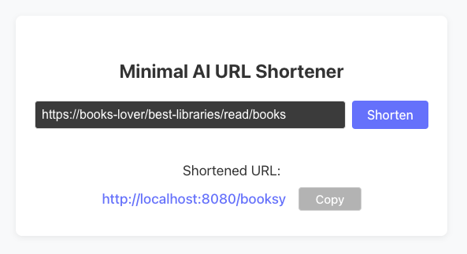

# Go AI URL Shortener

A simple, lightweight URL shortener featuring **AI-powered slug generation**. Built with Go, Gin framework, Redis for persistent storage, and OpenAI API. Includes a minimal React frontend.



## Features

- Create short URLs from long URLs
- **AI-powered slug generation** for catchy and meaningful URLs
- Automatic fallback when AI is unavailable
- Redirect short URLs to original URLs
- **Redis persistent storage** with automatic expiration (1 year TTL)
- RESTful API endpoints
- Health check endpoint

## Prerequisites

- Go 1.24 or higher
- Redis server (can be run locally with Docker)
- OpenAI API key (for AI-powered slug generation)

## Quick Start with Docker

1. **Create an `.env` file**  
   Add your OpenAI API key: 
   ```bash
   OPENAI_API_KEY=<your-key>
   ```

2. **Start Redis**  
   Run Redis using Docker Compose:
   ```bash
   docker-compose up -d redis
   ```

3. **Start the service**  
   Run the Go server:
   ```bash
   go run .
   ```

4. **Access the service**  
   The server will start on `http://localhost:8080`.

## API Endpoints

### Create Short URL
```
POST /api/urls
Content-Type: application/json

{
  "url": "https://www.my-books.com/favorites/best-book/info"
}
```

Response:
```json
{
  "original_url": "https://www.my-books.com/favorites/best-book/info",
  "short_code": "bestbook",
  "short_url": "http://localhost:8080/bestbook",
  "slug_type": "ai_generated"
}
```

- **`slug_type`**: Indicates whether the slug was AI-generated or hash-based.

### Redirect to Original URL
```
GET /:shortCode
```

Redirects the user to the original URL.

### Health Check
```
GET /health
```

Response:
```json
{
  "status": "healthy",
  "storage": "redis"
}
```

## Example Usage

### Create a Short URL
```bash
curl -X POST http://localhost:8080/urls \
  -H "Content-Type: application/json" \
  -d '{"url": "https://www.websites-about-good-coffee.com"}'
```

Response:
```json
{
  "original_url": "https://www.websites-about-good-coffee.com",
  "short_code": "goodbrew",
  "short_url": "http://localhost:8080/goodbrew",
  "slug_type": "ai_generated"
}
```

### Check Health
```bash
curl http://localhost:8080/health
```

### Access the Short URL
```bash
curl -L http://localhost:8080/goodbrew
```

## Frontend

A simple React frontend is included in the `frontend/` directory. It allows users to create short URLs via a user-friendly interface.

### Setup & Run

1. Install dependencies:
  ```bash
  cd frontend
  npm install
  ```
2. Start the development server:
  ```bash
  npm run dev
  ```
  The app will be available at `http://localhost:5173` by default.

### Frontend API Endpoint

The frontend communicates with the backend using the following endpoint:

- **POST `/api/urls`**

  Example request body:
  ```json
  {
   "url": "https://www.example.com"
  }
  ```

  The backend responds with the shortened URL and slug details.


## Technical Details

- **Storage**: Redis with automatic expiration (1 year TTL)
- **AI Slug Generation**: OpenAI GPT-3.5 Turbo for intelligent slug creation
- **Fallback**: SHA1 + Base62 encoding when AI is unavailable
- **Framework**: Gin web framework for high performance
- **Graceful Shutdown**: Proper cleanup on server termination
- **Error Handling**: Comprehensive error handling and logging
- **Slug Validation**: Ensures slugs are 3-8 characters, alphanumeric with hyphens
- **Frontend**: Interactive UI to shorten URLs

## Development

### Building
```bash
go build -o url-shortener main.go
```

### Running Tests
```bash
go test ./tests/... -v
```

## Areas of Improvement

- Dockerize the entire project for easier deployment
- Implement rate limiting for API endpoints
- Enhance logging for better observability