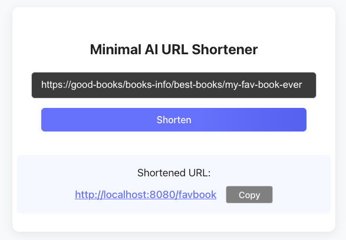

# AI URL Shortener

Most URL shorteners return random slugs — but what if your shortened link could have a catchy slug that actually captures the theme of your URL?

This project is an AI-powered URL shortener that generates meaningful slugs for your links.  It provides a fast, user-friendly way to create and share short links. 

Built with Go (Gin framework), Redis for persistent storage, OpenAI API, Docker, and a minimal React frontend. 



## Table of Contents
- [System Design](#system-design)
- [Features](#features)
- [Prerequisites](#prerequisites)
- [Quick Start with Docker](#quick-start-with-docker)
- [Running Locally](#running-locally-frontend-backend-redis)
- [API Endpoints](#api-endpoints)
- [Example Usage](#example-usage)
- [Frontend](#frontend)
- [Technical Details](#technical-details)
- [Development](#development)


## System Design

```
                ┌───────────────────────┐
                │       React UI        │
                │  (User enters URL)    │
                └───────────┬───────────┘
                            │ REST API
                            ▼
                ┌───────────────────────┐
                │    Go + Gin Backend   │
                │                       │
                │ Endpoints:            │
                │ - POST /shorten       │
                │ - GET /:slug          │
                │ - GET /health         │
                └──────┬─────────┬──────┘
                       │         │
      ┌────────────────┘         └────────────────┐
      ▼                                         ▼
┌───────────────┐                        ┌─────────────────┐
│    OpenAI API │                        │     Redis DB    │
│ (Slug Suggest)│                        │ short→long URLs │
└───────────────┘                        │ TTL = 1 year    │
                                         └─────────────────┘
```

```
User Browser ── GET /catchy-slug ──► Gin Backend
                                 │
                                 ▼
                          Lookup slug in Redis
                                 │
                   ┌─────────────┴─────────────┐
                   │                           │
          Slug found (long URL)        Slug not found
                   │                           │
                   ▼                           ▼
   Return HTTP 302 Redirect          Return 404 / Error page
   Location: long URL
                   │
                   ▼
User Browser ── GET long URL ──► Destination website
```

## Features

- Create short URLs from long URLs
- **AI-powered slug generation** for catchy and meaningful URLs
- Automatic fallback when AI is unavailable
- Redirect short URLs to original URLs
- **Redis persistent storage** with automatic expiration (1 year TTL)
- RESTful API endpoints
- Health check endpoint

## Prerequisites

- OpenAI API key (for AI-powered slug generation)

## Quick Start with Docker

1. **Create an `.env` file**  
   Add your OpenAI API key: 
   ```bash
   OPENAI_API_KEY=<your-key>
   ```

  Optionally, you can also define a `SERVER_PORT` env variable (default is 8080).

2. **Run Docker-Compose**  
   ```bash
   docker-compose up -d

4. **Access the service**  
   Access `http://localhost:3000`.

## Running Locally (Frontend, Backend, Redis)

### 1. Start Redis
You can run Redis locally using Docker:

```bash
docker-compose up -d redis
```

### 2. Run the Backend (Go server)
1. Install dependencies (if needed):
  ```bash
  cd server
  go mod tidy
  ```
2. Start the server:
  ```bash
  go run main.go
  ```
  The backend will listen on the port specified in your `.env` (default: `8080`).

### 3. Run the Frontend (React app)
1. Install dependencies:
  ```bash
  cd frontend
  npm install
  ```
2. Start the development server:
  ```bash
  npm run dev
  ```
  The frontend will be available at `http://localhost:3000`.

### 4. Access the App
- Frontend: [http://localhost:3000](http://localhost:3000)
- Backend API: [http://localhost:8080](http://localhost:8080)
- Redis: [localhost:6379](localhost:6379)

**Note:** Ensure the backend is running before using the frontend. The backend must be able to connect to Redis.

## API Endpoints

### Create Short URL
```
POST /api/urls
Content-Type: application/json

{
  "url": "https://www.my-books.com/favorites/best-book/info"
}
```

Response:
```json
{
  "original_url": "https://www.my-books.com/favorites/best-book/info",
  "short_code": "bestbook",
  "short_url": "http://localhost:8080/bestbook",
  "slug_type": "ai_generated"
}
```

- **`slug_type`**: Indicates whether the slug was AI-generated or hash-based.

### Redirect to Original URL
```
GET /:shortCode
```

Redirects the user to the original URL.

### Health Check
```
GET /health
```

Response:
```json
{
  "status": "healthy",
  "storage": "redis"
}
```

## Example Usage

### Create a Short URL
```bash
curl -X POST http://localhost:8080/api/urls \
  -H "Content-Type: application/json" \
  -d '{"url": "https://www.websites-about-good-coffee.com"}'
```

Response:
```json
{
  "original_url": "https://www.websites-about-good-coffee.com",
  "short_code": "goodbrew",
  "short_url": "http://localhost:8080/goodbrew",
  "slug_type": "ai_generated"
}
```

### Check Health
```bash
curl http://localhost:8080/health
```

### Access the Short URL
```bash
curl -L http://localhost:8080/goodbrew
```

## Frontend

A simple React frontend is included in the `frontend/` directory. It allows users to create short URLs via a user-friendly interface.

### Setup & Run

1. Install dependencies:
  ```bash
  cd frontend
  npm install
  ```
2. Start the development server:
  ```bash
  npm run dev
  ```
  The app will be available at `http://localhost:5173` by default.

### Frontend API Endpoint

The frontend communicates with the backend using the following endpoint:

- **POST `/api/urls`**

  Example request body:
  ```json
  {
   "url": "https://www.example.com"
  }
  ```

  The backend responds with the shortened URL and slug details.


## Technical Details

- **Storage**: Redis with automatic expiration (1 year TTL)
- **AI Slug Generation**: OpenAI GPT-3.5 Turbo for intelligent slug creation
- **Fallback**: SHA1 + Base62 encoding when AI is unavailable
- **Framework**: Gin web framework for high performance
- **Graceful Shutdown**: Proper cleanup on server termination
- **Error Handling**: Comprehensive error handling and logging
- **Slug Validation**: Ensures slugs are 3-8 characters, alphanumeric with hyphens
- **Frontend**: Interactive UI to shorten URLs

## Development

### Sever Build
```bash
cd server
go build -o url-shortener main.go
```

### Server Tests
```bash
cd server
go test ./tests/... -v
```

### Frontend Build
```bash
cd frontend
npm run build
```

### Frontend Tests
```bash
cd frontend
npm test
```